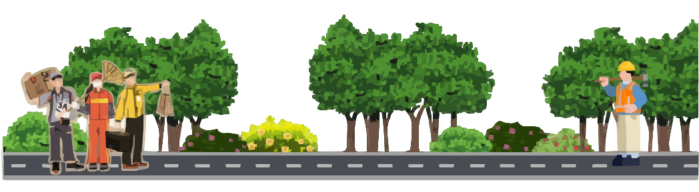
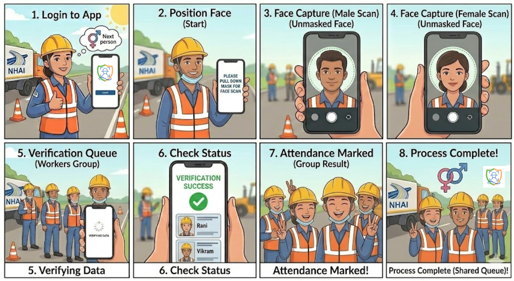
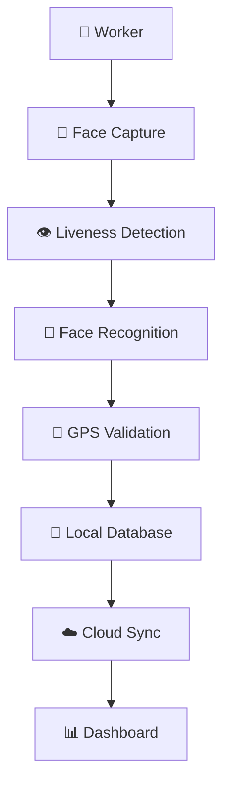

<p align="center">
  
</p>

<div align="center">


<div align="center">

<p align="center">

</p>

<br>


</div>

<p align="center">
  
  
</p>
<br>

<p align="center">
  
</p>


<p align="left">
  
</p>

# 🚀 Introducing PEHECHAAN

### Offline Facial Authentication for the Modern Workforce

PEHECHAAN is an AI-powered workforce authentication platform built for environments where traditional attendance systems fail.

From remote highway projects and construction sites to large-scale infrastructure operations, workforce verification often suffers from unreliable internet connectivity, attendance fraud, and identity spoofing.

PEHECHAAN addresses these challenges through a secure offline-first architecture powered by **Face Recognition**, **Liveness Detection**, **GPS Validation**, and **Edge AI**.

---

## ⚠️ Challenges in Traditional Workforce Authentication

<table>
<tr>

<td align="center" width="25%">


### Poor Connectivity

Authentication systems become unreliable in remote locations.

</td>

<td align="center" width="25%">


### Identity Spoofing

Photos and videos can bypass weak verification systems.

</td>

<td align="center" width="25%">


### Proxy Attendance

Workers can mark attendance on behalf of others.

</td>

<td align="center" width="25%">


### Location Fraud

Attendance can be recorded from unauthorized locations.

</td>

</tr>
</table>

---

## 💡 How PEHECHAAN Solves It

<table>
<tr>

<td align="center" width="25%">


### Face Recognition

Biometric identity verification using facial embeddings.

</td>

<td align="center" width="25%">


### Liveness Detection

Detects real users and prevents spoofing attacks.

</td>

<td align="center" width="25%">


### GPS Validation

Ensures workers are authenticated at approved locations.

</td>

<td align="center" width="25%">


### Offline First

Authentication works without internet connectivity.

</td>

</tr>
</table>

---

## 🎯 PEHECHAAN AT A GLANCE

<p align="center">

|  |  |  |  |  |
|:---:|:---:|:---:|:---:|:---:|
| Face Recognition | Liveness Detection | Secure Authentication | GPS Validation | Smart Sync |

</p>

---

<div align="center">

## 👷 ➜ 📸 ➜ 👁️ ➜ 🤖 ➜ 🔐 ➜ 📍 ➜ ☁️

### Capture • Verify • Authenticate • Track • Sync

</div>

---

## 🌟 Why PEHECHAAN?

✅ Works completely offline

✅ Prevents impersonation and attendance fraud

✅ Verifies worker presence through liveness detection

✅ Captures GPS-verified attendance

✅ Synchronizes records automatically

✅ Protects sensitive data through local processing

---

<p align="center">
  
</p>

<div align="center">

### Authenticate Anywhere • Trust Everywhere

Built for real-world workforce authentication where connectivity cannot be guaranteed.

</div>


# 🚀 About PEHECHAAN

PEHECHAAN is an AI-powered offline facial authentication and attendance system designed for workforce verification in remote and connectivity-constrained environments.

Traditional attendance systems depend heavily on cloud connectivity and are vulnerable to attendance fraud, proxy marking, and identity spoofing. PEHECHAAN addresses these challenges using Edge AI, facial recognition, liveness detection, GPS verification, and offline-first architecture.

### 🎯 Core Objectives

- Secure workforce authentication
- Prevent impersonation and proxy attendance
- Enable completely offline verification
- Capture location-based attendance records
- Synchronize data automatically when connectivity returns
- Preserve privacy through local processing

---

<p align="center">
  
</p>

# 👁️ Face Authentication in Action

PEHECHAAN performs real-time facial authentication directly on the device, allowing workers to verify their identity even in areas without internet access.

<p align="center">
  
</p>

### 🔍 Authentication Flow

📸 Face Capture

👁️ Liveness Detection

🧠 Facial Feature Extraction

🤖 Identity Matching

📍 GPS Validation

💾 Secure Local Storage

☁️ Cloud Synchronization

---

<p align="center">
  
</p>

# 🏗️ System Architecture

The architecture follows an offline-first approach where authentication, liveness detection, and attendance recording occur locally on the device. Attendance records are securely stored and automatically synchronized whenever network connectivity becomes available.

<p align="center">
  
</p>

### Architecture Highlights

- 📶 Offline-first operation
- 🤖 Edge AI processing
- 👁️ Liveness verification layer
- 📍 GPS-enabled attendance tracking
- 💾 Local secure storage
- ☁️ Automatic cloud synchronization
- 📊 Administrative monitoring support

---

<p align="center">
  
</p>

# 🔄 Authentication Workflow

The complete authentication lifecycle is illustrated below. From worker verification to attendance synchronization, every step is designed for reliability and security.

<p align="center">
  
</p>

### Step-by-Step Process

| Step | Description |
|--------|-------------|
| 📸 Face Scan | Capture worker image |
| 👁️ Liveness Check | Detect real person presence |
| 🤖 Face Matching | Compare facial embeddings |
| 📍 GPS Capture | Verify attendance location |
| 💾 Local Storage | Save attendance securely |
| ☁️ Sync Engine | Upload data when online |
| ✅ Attendance Logged | Final authenticated record |

---

<p align="center">
  
</p>

# ✨ Key Features

### 🧠 AI Face Recognition
Advanced facial embedding-based authentication for reliable identity verification.

### 👁️ Liveness Detection
Protects against spoofing attempts using photos, videos, or screen replays.

### 📶 Offline First
Authentication works without requiring internet connectivity.

### 📍 GPS Verification
Ensures attendance is recorded from the correct work location.

### ☁️ Smart Synchronization
Automatically uploads records once connectivity is restored.

### 🛡️ Privacy Focused
Sensitive biometric data is processed locally whenever possible.

### ⚡ High-Speed Verification
Authentication completed within milliseconds.

---

<p align="center">
  
</p>

# ⚡ Performance Metrics

| Metric | Performance |
|----------|----------|
| ⚡ Recognition Time | 200–400 ms |
| 📶 Internet Requirement | None |
| 🔐 Authentication | Offline |
| 📍 GPS Validation | Enabled |
| ☁️ Auto Synchronization | Enabled |
| 🛡️ Fraud Protection | High |

---

<p align="center">
  
</p>

# 💡 Why PEHECHAAN?

| Feature | Traditional Systems | PEHECHAAN |
|----------|----------|----------|
| Internet Required | ❌ | ✅ |
| Offline Authentication | ❌ | ✅ |
| Liveness Detection | ⚠️ | ✅ |
| GPS Validation | ⚠️ | ✅ |
| Automatic Sync | ❌ | ✅ |
| Privacy Focused | ⚠️ | ✅ |
| Fraud Protection | Low | High |

---

<p align="center">
  
</p>

# 🌍 Real World Applications

### 🛣️ Highway Infrastructure Projects
Secure attendance for field engineers and workers.

### 🏗️ Construction Sites
Reliable workforce verification across large sites.

### 🏭 Manufacturing Facilities
Identity-based workforce access management.

### 🚜 Agricultural Operations
Offline worker authentication in rural areas.

### 🏢 Government Projects
Large-scale personnel verification and attendance monitoring.

### 🏫 Educational Institutions
Identity validation for staff attendance systems.

---

<p align="center">
  
</p>

# 🖥️ Technology Stack

### Frontend
- React Native
- Expo

### Backend
- Node.js
- Express.js

### Database
- SQLite
- Local Storage

### AI / ML
- TensorFlow Lite
- Face Recognition Models
- Liveness Detection Models
- Edge AI
- TinyML

### Location Services
- GPS Tracking
- Geolocation Validation

---

# 📈 Scalability Roadmap

```text
Face Authentication      ██████████ 100%
Offline Storage          ██████████ 100%
GPS Validation           ██████████ 100%
Cloud Sync               █████████░ 90%

Admin Dashboard          ███████░░░ 70%
Analytics Module         ██████░░░░ 60%
Multi-language Support   ████░░░░░░ 40%
Enterprise Deployment    ███░░░░░░░ 30%
```

---

<p align="center">
  
</p>

# 🔮 Future Enhancements

- Aadhaar Integration
- Enterprise Analytics Dashboard
- Advanced Workforce Insights
- Edge AI Optimization
- Multi-language Support
- Multi-device Synchronization
- Predictive Attendance Analytics

---

# 👨‍💻 Team

<table align="center">
<tr>

<td align="center">

### 👩‍💻 AISHI DE

Frontend Development  
UI/UX Design  
Documentation & Presentation

</td>

<td align="center">

### 👨‍💻 PARTHIV ABHANI

Backend Development  
System Architecture  
Integration

</td>

<td align="center">

### 🤖 SHLOK VIJ

AI/ML Development  
Face Recognition  
Liveness Detection

</td>

</tr>
</table>

---

# 🏆 NHAI Hackathon 7.0

🛣️ Theme: Smart Workforce Authentication

🔐 Focus: Offline Identity Verification

🤖 Technology: Edge AI + TinyML

📍 Target: Field Workforce Management

---

<div align="center">

# 🚀 PEHECHAAN

### Authenticate Anywhere • Trust Everywhere

Built with ❤️ for NHAI Hackathon 7.0

### 👩‍💻 AISHI DE • 👨‍💻 PARTHIV ABHANI • 🤖 SHLOK VIJ

</div>


---

<div align="center">

# 🛣️ 👷 📸 👁️ 🤖 🔐 📍 ☁️

### Secure Workforce Authentication for the Real World

</div>

---

<p align="center">
🚧━━━━━━━━━━━━━━━━━━━━━━━━━━━━━━━━━━━━━━━━━━━━━━━━━━━━🚧
</p>

# 🎯 Problem Statement

<p align="center">


</p>

Managing attendance and identity verification for field workers remains a major challenge, especially in remote locations where internet connectivity is unreliable.

### Existing Challenges

❌ Dependence on cloud connectivity

❌ Proxy attendance and impersonation

❌ Limited identity verification

❌ Poor performance in low-network areas

Pehechaan solves these problems through AI-powered offline authentication.

---

<p align="center">
🚗══════════════════════════════════════════════════════🛣️
</p>

# 💡 Our Solution

Pehechaan is an AI-powered offline facial authentication and attendance platform built for field workers operating in connectivity-constrained environments.

### Core Capabilities

👤 Face Recognition

👁️ Liveness Detection

📶 Offline Authentication

📍 GPS Verification

☁️ Smart Synchronization

🛡️ Privacy-First Processing

---

<div align="center">

## 👤 ➜ 👁️ ➜ 🤖 ➜ 🔐 ➜ 📍 ➜ ☁️

### Capture → Verify → Authenticate → Track → Sync

</div>

---

# ✨ Key Features

### 🧠 AI Face Recognition
Secure biometric verification using facial embeddings.

### 👁️ Liveness Detection
Prevents spoofing through photographs and recorded videos.

### 📶 Offline First
Authentication works completely without internet connectivity.

### 📍 GPS Verification
Ensures location-aware attendance validation.

### ☁️ Automatic Synchronization
Uploads attendance records once connectivity returns.

### 🛡️ Privacy Focused
Processes sensitive data locally whenever possible.

### ⚡ Fast Verification
Authentication in milliseconds.

---

<p align="center">
🚧━━━━━━━━━━ HIGHWAY AUTHENTICATION JOURNEY ━━━━━━━━━━🚧
</p>

# 🔄 Authentication Workflow

```text
👷 Worker
      │
      ▼
📸 Face Scan
      │
      ▼
👁️ Liveness Check
      │
      ▼
🤖 Face Matching
      │
      ▼
📍 GPS Capture
      │
      ▼
💾 Local Storage
      │
      ▼
☁️ Cloud Sync
      │
      ▼
✅ Attendance Recorded
```

---

# 🧠 AI Authentication Pipeline

```text
📸 Face Capture
       │
       ▼
🖼️ Image Processing
       │
       ▼
👁️ Liveness Detection
       │
       ▼
🧠 Feature Extraction
       │
       ▼
🤖 Face Matching
       │
       ▼
✅ Authentication Result
```

---

# 🏗️ System Architecture



---

# ⚡ Performance Metrics

| Metric | Performance |
|----------|----------|
| ⚡ Recognition Time | 200–400 ms |
| 📶 Internet Requirement | None |
| 🔐 Authentication | Offline |
| 📍 GPS Validation | Enabled |
| ☁️ Auto Sync | Enabled |
| 🛡️ Fraud Protection | High |

---

<p align="center">
🛣️══════════════════════════════════════════════════════🏁
</p>

# 📊 Project Impact

Pehechaan addresses workforce authentication challenges in sectors where connectivity cannot be guaranteed.

| Sector | Impact |
|----------|----------|
| 🛣️ Highway Projects | Workforce Verification |
| 🏗️ Construction Sites | Attendance Tracking |
| 🚜 Field Operations | Offline Authentication |
| 🏭 Manufacturing | Secure Access |
| 🏢 Government Services | Identity Validation |

### Benefits

✅ Offline Authentication

✅ Reduced Attendance Fraud

✅ Faster Verification

✅ Enhanced Privacy

✅ Lower Infrastructure Costs

---

# 📈 Scalability

Designed for deployment from local teams to enterprise-scale infrastructure projects.

### Current Capabilities

- Offline Authentication
- GPS Validation
- Local Storage
- Smart Synchronization

### Future Expansion

🚀 Multi-region deployment

🚀 Enterprise dashboards

🚀 100,000+ workforce support

🚀 Edge AI acceleration

🚀 Multi-language support

🚀 Advanced analytics

---

# 🆚 Why Pehechaan?

| Feature | Traditional Systems | Pehechaan |
|----------|----------|----------|
| Internet Required | ❌ | ✅ |
| Offline Authentication | ❌ | ✅ |
| Liveness Detection | ⚠️ | ✅ |
| GPS Validation | ⚠️ | ✅ |
| Privacy Focused | ⚠️ | ✅ |
| Automatic Sync | ❌ | ✅ |
| Fraud Protection | Low | High |

---

# 🖥️ Technology Stack

### Frontend

- React Native
- Expo

### Backend

- Node.js
- Express.js

### Database

- SQLite
- Local Storage

### AI/ML

- TensorFlow Lite
- Face Recognition
- Liveness Detection
- Edge AI
- TinyML

---

# 🎬 Demonstration

<p align="center">

</p>

---

# 📱 Application Screens

<p align="center">


</p>

---

# 🛣️ Development Roadmap

```text
Face Authentication      ██████████ 100%
Offline Storage          ██████████ 100%
GPS Validation           ██████████ 100%
Cloud Sync               █████████░ 90%

Admin Dashboard          ███████░░░ 70%
Analytics Module         ██████░░░░ 60%
Multi-language Support   ████░░░░░░ 40%
Enterprise Deployment    ███░░░░░░░ 30%
```

---

# 🌍 Real World Applications

🛣️ Highway Workforce Monitoring

🏗️ Construction Site Management

🏭 Manufacturing Attendance

🏢 Government Infrastructure Projects

🚜 Agricultural Workforce Tracking

🏫 Educational Institutions

---

# 🔮 Future Enhancements

- Aadhaar Integration
- Enterprise Analytics
- Edge AI Optimization
- Multi-language Support
- Smart Workforce Insights
- Multi-device Synchronization

---


<p align="center">
🏁━━━━━━━━━━━━━━ TEAM PEHECHAAN ━━━━━━━━━━━━━━🏁
</p>

# ⚙️ Team

<table align="center">
<tr>

<td align="center">

### 👩🏻‍💻 AISHI DE

Frontend Development  
UI/UX Design  
Documentation & Presentation

</td>

<td align="center">

### 🧑🏻‍💻 PARTHIV ABHANI

Backend Development  
System Architecture  
Integration

</td>

<td align="center">

### 👨🏻‍💻 SHLOK VIJ

AI/ML Development  
Face Recognition  
Liveness Detection

</td>
</tr>
</table>

---

# 🏆 NHAI Hackathon 7.0

🛣️ Theme: Smart Workforce Authentication

🔐 Focus: Offline Identity Verification

🤖 Technology: Edge AI + TinyML

📍 Target: Field Workforce Management

---

<div align="center">

Built with ❤️ for NHAI Hackathon 7.0

</div>


