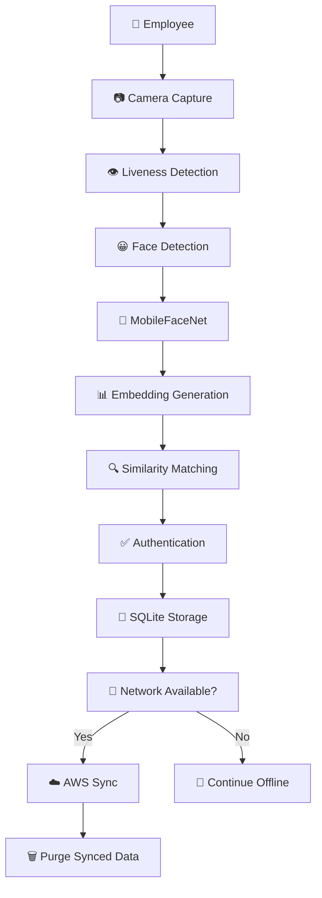
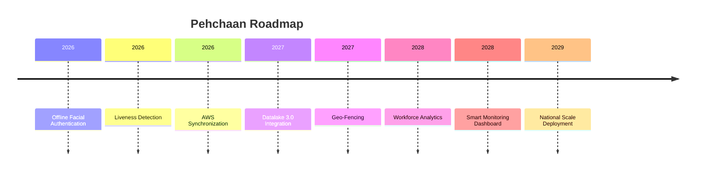

<p align="center">
  
</p>


<div align="center">


</div>

<div align="center">

---
<div align="center">


</div>

<div align="center">


</div>

---

<div align="center">

### 🛣️ India's Highways Never Stop. Neither Does Pehchaan.


</div>

---

# 🚧 Highway Authentication Workflow


---

<div align="center">

## 🌍 Built for India's Expanding Highway Network

</div>

| 🛣️ National Highways | 🚧 Construction Corridors |
|---------------------|---------------------------|
| 👷 Workforce Authentication | 🏗️ Contractor Verification |
| 📍 GPS Attendance | 📊 Audit Trail |
| 🧠 Edge AI | ☁️ Smart Sync |

---

<div align="center">

## 🚀 Real-Time Authentication Journey


</div>

---

<div align="center">

### 🛣️ Highway Infrastructure × Artificial Intelligence

```text
══════════════════════════════════════════════

🚧 FIELD PERSONNEL

        ↓

📷 FACE CAPTURE

        ↓

👁️ LIVENESS DETECTION

        ↓

🧠 EDGE AI AUTHENTICATION

        ↓

📍 GPS VERIFIED ATTENDANCE

        ↓

💾 OFFLINE STORAGE

        ↓

☁️ AWS SYNC

══════════════════════════════════════════════
```

</div>

---

<div align="center">

## 🇮🇳 Designed for NHAI Hackathon 7.0


</div>

<div align="center">

### 🛣️ Authenticate Anywhere. Trust Everywhere.

</div>

---

# 🛣️ PEHCHAAN


<br>


</div>

---

<div align="center">

## 🚧 Securing India's Highways with Offline AI

*"Designed for engineers, inspectors, contractors, and field personnel working where networks don't reach."*

</div>

---

## 🌟 Overview

Pehchaan is an **AI-powered Offline Facial Authentication Platform** built specifically for highway projects, remote infrastructure operations, and field workforce management.

Unlike traditional attendance systems that depend on cloud connectivity, Pehchaan performs:

✅ Facial Recognition

✅ Liveness Detection

✅ Attendance Logging

✅ GPS Verification

✅ Local Data Storage

completely **offline on-device** using **Edge AI** and **TinyML** technologies.

---

## 🎥 Project Demo Flow



---

# 🛣️ Why Pehchaan?

<table>
<tr>
<td width="50%">

### ❌ Traditional Systems

- Internet Dependent
- Attendance Fraud
- Cloud Latency
- Network Failure Risk
- Limited Security

</td>

<td width="50%">

### ✅ Pehchaan

- 100% Offline
- AI Liveness Detection
- Edge Processing
- Instant Authentication
- Privacy First

</td>
</tr>
</table>

---

# 🚀 Key Features

## 👁️ AI Liveness Detection

Random challenge-response verification.

### Supported Challenges

- 👀 Blink Detection
- 😊 Smile Detection
- ↔️ Head Turn Detection

### Prevents

❌ Printed Photo Attacks

❌ Screenshot Attacks

❌ Video Replay Attacks

❌ Spoofing Attempts

---

## 🧠 Offline Facial Recognition

Powered by MobileFaceNet running through TensorFlow Lite.

### Recognition Pipeline

```text
Capture Face
      ↓
Detect Face
      ↓
Crop 112×112
      ↓
Normalize
      ↓
Generate Embedding
      ↓
Cosine Similarity
      ↓
Authentication Result
```

---

## ⚡ Edge AI Architecture

```text
Cloud AI ❌

Device AI ✅

Internet Required ❌

Privacy Leakage ❌

Real-Time Processing ✅
```

---

## 📍 GPS Verified Attendance

Every authentication stores:

```yaml
Employee ID
Employee Name
Timestamp
Latitude
Longitude
Confidence Score
Liveness Status
```

Creating a trusted audit trail for field operations.

---

# 🏗️ System Architecture


---


## 🚀 Real-Time Authentication Journey


---

---

# 🛡️ Security Layers

<table>
<tr>
<td>👁️</td>
<td><b>Liveness Detection</b></td>
</tr>

<tr>
<td>🔒</td>
<td><b>On-Device Processing</b></td>
</tr>

<tr>
<td>🧠</td>
<td><b>Embedding-Based Storage</b></td>
</tr>

<tr>
<td>☁️</td>
<td><b>AWS Signature V4 Security</b></td>
</tr>

<tr>
<td>🛡️</td>
<td><b>Privacy-First Architecture</b></td>
</tr>

</table>

---

# ⚙️ Technology Stack

<div align="center">

| Layer | Technology |
|---------|-------------|
| Mobile App | React Native |
| AI Engine | TensorFlow Lite |
| Face Recognition | MobileFaceNet |
| Camera | Vision Camera |
| Local Database | SQLite |
| State Management | Zustand |
| Connectivity | NetInfo |
| Cloud | AWS S3 |

</div>

---

# 📊 Performance Benchmarks

| Metric | Result |
|----------|----------|
| Recognition Time | ⚡ 200–400 ms |
| Liveness Detection | ⚡ 2–3 sec |
| Accuracy Target | 🎯 >95% |
| Model Size | 📦 ~5 MB |
| RAM Requirement | 💾 3 GB |
| Offline Capability | 🌐 100% |
| Android Support | 🤖 Android 8+ |
| iOS Support | 🍎 iOS 12+ |

---

# 🚦 Highway Deployment Scenarios

### 🛣️ National Highway Projects

Track workforce attendance across remote highway corridors.

### 🚧 Construction Sites

Prevent attendance fraud in infrastructure projects.

### ⛏️ Mining Operations

Authenticate workers without network dependency.

### ⚡ Utility Field Services

Enable secure workforce verification in remote areas.

### 🏭 Industrial Facilities

Provide scalable identity verification systems.

---

# 🔮 Future Roadmap



---

# ✅ Hackathon Requirement Compliance

| Requirement | Status |
|------------|---------|
| React Native | ✅ |
| Android Support | ✅ |
| iOS Support | ✅ |
| Offline Recognition | ✅ |
| Liveness Detection | ✅ |
| TinyML Deployment | ✅ |
| AWS Integration | ✅ |
| Edge AI | ✅ |
| Lightweight Model | ✅ |

---

<div align="center">

## 🇮🇳 Built for NHAI Hackathon 7.0

### Securing India's Highway Workforce Through AI


</div>


