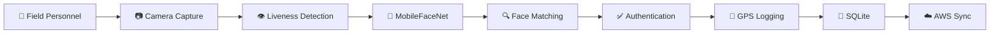

<p align="center">
  
</p>


# 🛣️ PEHCHAAN

<div align="center">


</div>

---

# 🚗 Smart Highway Authentication

<div align="center">

```text
═══════════════════════════════════════════════════════════════

🚗 ─────── 🚚 ─────── 🚙 ─────── 🚓 ─────── 🚛

                    PEHCHAAN

     AI-Powered Offline Workforce Authentication

═══════════════════════════════════════════════════════════════
```

</div>

---

# 📖 Overview

Pehchaan is an AI-powered offline facial authentication platform built for remote highway projects, infrastructure sites, construction corridors, and field workforce operations.

✅ Offline Facial Recognition  
✅ Liveness Detection  
✅ GPS Verification  
✅ SQLite Storage  
✅ AWS Synchronization  
✅ Edge AI Processing  

---

# 🚧 NHAI Checkpoint Authentication

```text
🚗──────────────▶ 🚧 NHAI CHECKPOINT

                 📷 FACE SCAN

                 👁️ LIVENESS CHECK

                 🧠 AI VERIFICATION

                 ✅ ACCESS GRANTED

🚗────────────────────────────────▶
```

---

# 🟩 Real-Time Authentication Journey

```text
🟩⬛⬛🟩   🟩⬛⬛🟩   ⬛🟩🟩⬛   🟩🟩🟩🟩
🟩🟩⬛🟩   🟩⬛⬛🟩   🟩⬛⬛🟩      🟩
🟩⬛🟩🟩   🟩🟩🟩🟩   🟩🟩🟩🟩      🟩
🟩⬛⬛🟩   🟩⬛⬛🟩   🟩⬛⬛🟩      🟩
🟩⬛⬛🟩   🟩⬛⬛🟩   🟩⬛⬛🟩   🟩🟩🟩🟩
```

**Green authentication blocks form NHAI.**

---

# 📷 Facial Recognition Scanner

```text
┌─────────────────┐
│       😀        │
└─────────────────┘

██████████████████
SCANNING FACE...
██████████████████

Confidence Score : 98.7%
Liveness Check   : Passed
Status           : VERIFIED
```

---

# 🏗️ System Architecture



---

# ⚙️ Technology Stack

| Layer | Technology |
|---------|---------|
| Mobile | React Native |
| AI | TensorFlow Lite |
| Recognition | MobileFaceNet |
| Camera | Vision Camera |
| Database | SQLite |
| State | Zustand |
| Connectivity | NetInfo |
| Cloud | AWS S3 |

---

# ☁️ Offline → Online Sync

```text
📱 Device
    │
    ▼
💾 SQLite Storage
    │
    ▼
📡 Network Available
    │
    ▼
☁️ AWS Upload
    │
    ▼
✅ Verification
    │
    ▼
🗑️ Local Purge
```

---

# 📊 Performance

| Metric | Value |
|---------|---------|
| Recognition Speed | 200-400 ms |
| Liveness Detection | 2-3 sec |
| Accuracy Target | >95% |
| Offline Capability | 100% |
| Model Size | ~5 MB |
| RAM Requirement | 3 GB |

---

# 🛣️ Highway Roadmap

```text
2026 ───────── 2027 ───────── 2028 ───────── 2029

🚗
 │
 ├── Offline Authentication
 ├── Datalake 3.0 Integration
 ├── Geo-Fencing
 ├── Analytics Dashboard
 └── National Scale Deployment
```

---

# ✅ Hackathon Compliance

- ✅ React Native
- ✅ Android Support
- ✅ iOS Support
- ✅ Offline Facial Recognition
- ✅ Liveness Detection
- ✅ Edge AI
- ✅ TinyML
- ✅ AWS Synchronization
- ✅ Lightweight Model

---

<div align="center">

## 🇮🇳 Built for NHAI Hackathon 7.0 by Team Semicolonists

Members:
- Aishi De
- Parthiv Abhani
- Shlok Vij

### Authenticate Anywhere. Trust Everywhere.

</div>
