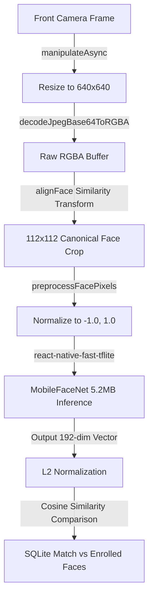

<!-- Animated SVG Header Banner representing Face Verification scanning in Indian Flag hues -->
<svg xmlns="http://www.w3.org/2000/svg" viewBox="0 0 800 300" width="100%" height="300" style="background:#090d1a; font-family:'Segoe UI',Roboto,sans-serif; border-radius:12px;">
  <style>
    @keyframes scan {
      0% { transform: translateY(0px); opacity: 0.4; }
      50% { transform: translateY(220px); opacity: 1; }
      100% { transform: translateY(0px); opacity: 0.4; }
    }
    @keyframes pulse {
      0% { opacity: 0.2; }
      50% { opacity: 0.6; }
      100% { opacity: 0.2; }
    }
    @keyframes spin {
      0% { transform: rotate(0deg); }
      100% { transform: rotate(360deg); }
    }
    .scanner-line {
      animation: scan 5s ease-in-out infinite;
      stroke: url(#laser-grad);
    }
    .grid-bg {
      stroke: #172554;
      stroke-width: 0.5;
    }
    .hud-circle {
      transform-origin: 400px 150px;
      animation: spin 25s linear infinite;
    }
    .flag-saffron { fill: #FF9933; }
    .flag-white { fill: #FFFFFF; }
    .flag-green { fill: #138808; }
    .text-title { font-weight: 900; font-size: 42px; fill: #ffffff; letter-spacing: 6px; }
    .text-subtitle { font-size: 13px; fill: #94a3b8; letter-spacing: 3px; font-weight: 700; text-transform: uppercase; }
  </style>
  
  <defs>
    <linearGradient id="laser-grad" x1="0%" y1="0%" x2="100%" y2="0%">
      <stop offset="0%" stop-color="#FF9933" />
      <stop offset="50%" stop-color="#FFFFFF" />
      <stop offset="100%" stop-color="#138808" />
    </linearGradient>
    
    <pattern id="grid" width="25" height="25" patternUnits="userSpaceOnUse">
      <path d="M 25 0 L 0 0 0 25" fill="none" class="grid-bg"/>
    </pattern>
  </defs>

  <!-- Background grid -->
  <rect width="800" height="300" fill="url(#grid)" />
  
  <!-- Left Side: NHAI / Indian Flag Colors subtle accent -->
  <rect x="0" y="0" width="8" height="100" class="flag-saffron" />
  <rect x="0" y="100" width="8" height="100" class="flag-white" />
  <rect x="0" y="200" width="8" height="100" class="flag-green" />

  <!-- Animated HUD Circles -->
  <circle cx="400" cy="150" r="110" fill="none" stroke="rgba(99, 102, 241, 0.15)" stroke-width="1.5" />
  <circle cx="400" cy="150" r="95" fill="none" stroke="rgba(255, 153, 51, 0.3)" stroke-width="2" stroke-dasharray="15 35" class="hud-circle" />
  <circle cx="400" cy="150" r="80" fill="none" stroke="#138808" stroke-width="1.5" stroke-dasharray="5 15" opacity="0.6" style="animation: spin 12s linear infinite reverse; transform-origin: 400px 150px;" />

  <!-- Face Silhouette Graphic in the center -->
  <path d="M400,90 C380,90 365,108 365,135 C365,168 380,190 400,190 C420,190 435,168 435,135 C435,108 420,90 400,90 Z M387,128 C387,124 390,121 394,121 C398,121 401,124 401,128 C401,132 398,135 394,135 C390,135 387,132 387,128 Z M413,128 C413,124 416,121 420,121 C424,121 427,124 427,128 C427,132 424,135 420,135 C416,135 413,132 413,128 Z" fill="none" stroke="rgba(255, 255, 255, 0.35)" stroke-width="2" />
  
  <!-- Saffron, White, and Green Scanning Laser -->
  <line x1="40" y1="40" x2="760" y2="40" stroke-width="3" class="scanner-line" />

  <!-- Title Texts -->
  <text x="400" y="250" text-anchor="middle" class="text-title">PEHCHAAN</text>
  <text x="400" y="275" text-anchor="middle" class="text-subtitle">NHAI Secure Offline Verification Platform</text>
</svg>

<br/>

[-6366F1?style=for-the-badge&logo=react)](https://reactnative.dev)
[](https://tensorflow.org)
[](https://sqlite.org)
[](#)

---

# PEHCHAAN (पहचान)

An enterprise-grade, offline-first biometric authentication and active liveness verification system specifically designed for the **National Highways Authority of India (NHAI)**, Ministry of Road Transport and Highways (MoRTH).

The application executes low-latency face identification and anti-spoofing routines directly on standard mid-range mobile hardware without requiring active cellular coverage, keeping personnel tracking secure and auditable in remote highway sectors, tunnels, and toll booth corridors.

---

## 🏛️ NHAI Ecosystem Alignment & Compliance

NHAI operations involve distributed, third-party concessionaires and contractors managing highway maintenance, patrols, tolling plazas, and construction sites. The Pehchaan engine directly addresses these operational hurdles:

* **Proxy Attendance Blockage:** Eliminates "buddy punching" (photo holding or identity spoofing) for labor compliance auditing.
* **Telecom Resiliency:** Functions inside remote highway corridors or deep tunnels with absolute network blackout.
* **Data Privacy Compliance:** All biometric vectors remain local to the device Keystore/SQLite buffer. Raw photos are processed in memory and never written to permanent disk storage.
* **Unified DataLake Sync:** Syncs batch logs in JSON formats directly to AWS S3 using custom local Web Cryptography signing calculations that bypass heavy third-party client wrappers.

---

## ⚙️ Biometric Processing Pipeline

Pehchaan implements a sequential, low-latency execution pipeline:



### 1. Spatial Normalization & Alignment
Using coordinates from the face landmark detector, the engine calculates the rotation angle ($\theta$) and the scale factor ($s$) between the eyes:
$$\theta = \text{atan2}(d_y, d_x)$$
$$s = \frac{\text{canonicalDistance}}{\text{actualDistance}}$$

The raw RGBA frame is translated, rotated, and scaled into a $112 \times 112$ canonical bounding box using nearest-neighbor coordinates mapping, resolving pose alignment issues in harsh sun glare or night shadow settings.

### 2. Neural Vector Comparison
* **Forward Pass:** The native TFLite interpreter handles inference on the normalized $112 \times 112 \times 3$ float array in **50ms – 150ms** on standard CPUs.
* **Match Score:** Compares the normalized query embedding vector ($\vec{A}$) against local SQLite database profile embeddings ($\vec{B}$) using **Cosine Similarity**:
  $$\text{Similarity}(\vec{A}, \vec{B}) = \frac{\vec{A} \cdot \vec{B}}{\|\vec{A}\|_2 \|\vec{B}\|_2}$$
  * A threshold of **`0.65`** is configured for accurate matching without demographic skew.

---

## 👁️ Challenge-Response Liveness Detection

To verify user presence, the application employs a randomized challenge-response loop, validating physical indicators dynamically:

* **Blink Loop (`BlinkDetector`):** Verifies the average eye openness index falls below $0.3$ (fully closed) and reopens above $0.7$ within a rolling 5-second interval.
* **Pose Yaw Loop (`HeadTurnDetector`):** Establishes a zero-baseline face angle, then detects horizontal movement past a strict $\pm 20^\circ$ yaw angle boundary.
* **Smiling Check (`SmileDetector`):** Monitors mouth stretching against a smile probability index threshold of $0.75$.

---

## 📍 Offgrid Database Caching & S3 Synchronization

Pehchaan decouples network dependencies from active operations using a dual-table SQLite storage pattern:

### 1. Non-Blocking GPS Prefetching
* The app queries foreground permissions and runs location prefetching (`Location.Accuracy.High`) asynchronously when the camera screen mounts.
* On matching, the coordinates are read instantly from the active memory cache in **0ms**, avoiding any blocking GPS hardware locks.

### 2. Dual-Table Caching
* **`attendance_records`:** Stores detailed logs (ID, confidence, location JSON, timestamps, sync flag).
* **`unique_attendance_days`:** A compact registry tracking unique `(employee_id, date)` combinations.
* **Storage Optimization:** Upon internet recovery, S3 uploads the detailed JSON log batch and executes a purge on `attendance_records` to prevent local disk expansion. However, the logs in `unique_attendance_days` are never purged, allowing local calendars and streaks to remain fully functional offline.

---

## 🛠️ Setup & Local Configuration

### Environment Variables
Create a local `.env` file at the root:
```env
EXPO_PUBLIC_AWS_REGION=ap-south-1
EXPO_PUBLIC_S3_BUCKET=pehchaan-attendance-data
EXPO_PUBLIC_AWS_ACCESS_KEY_ID=YOUR_AWS_ACCESS_KEY_ID
EXPO_PUBLIC_AWS_SECRET_ACCESS_KEY=YOUR_AWS_SECRET_ACCESS_KEY
```

### Dependency Setup
Run the following commands to install libraries:
```bash
npx expo install react-native-vision-camera expo-sqlite expo-image-manipulator expo-location expo-linear-gradient react-native-reanimated
```

---

## 👥 Contributors

* 👨‍💻 **Mahak Mehadia**
* 👨‍💻 **Parthiv Abhani**
* 👨‍💻 **Shlok Vij**
