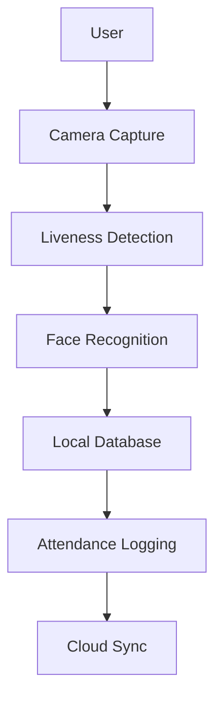

<p align="center">
  
</p>


<div align="center">


<div align="center">


<br>


</div>


<p align="center">
  
  
  
  
  
</p>

---

## 🎯 Problem Statement

Managing attendance and identity verification for field workers remains a major challenge, especially in remote locations where internet connectivity is unreliable.

Traditional systems:

- Depend heavily on cloud connectivity
- Are vulnerable to proxy attendance
- Lack robust identity verification
- Struggle in low-network environments

Pehechaan solves these issues through a secure, AI-powered, offline-first authentication system.

---

<p align="center">
🚗══════════════════════════════════════════════════════🛣️
</p>

## 💡 Our Solution

Pehechaan is an AI-powered offline facial authentication and attendance platform designed for workforce verification in remote and infrastructure-heavy environments.

Using facial recognition, liveness detection, GPS validation, and local data storage, the system ensures reliable authentication even without internet access.

Once connectivity is restored, all attendance records are automatically synchronized with the cloud.

---

## ✨ Key Features

| Feature | Description |
|----------|-------------|
| 🔐 Face Authentication | AI-based identity verification |
| 👁️ Liveness Detection | Prevents spoofing using photos/videos |
| 📶 Offline First | Works without internet |
| 📍 GPS Logging | Location-based attendance validation |
| ☁️ Auto Synchronization | Syncs data once connectivity returns |
| 🛡️ Privacy Focused | Local processing minimizes data exposure |
| ⚡ Fast Verification | Recognition within milliseconds |

---

<p align="center">
🚧══════════════ HIGHWAY AUTHENTICATION JOURNEY ══════════════🚧
</p>

## 🔄 Workflow

```text
📸 Face Capture
       ↓
👁️ Liveness Detection
       ↓
🤖 Face Recognition
       ↓
📍 GPS Validation
       ↓
💾 Local Storage
       ↓
☁️ Cloud Synchronization
```

---

## 🏗️ System Architecture



---

## ⚡ Performance Metrics

| Metric | Value |
|----------|----------|
| Recognition Time | 200–400 ms |
| Internet Dependency | None |
| Authentication Mode | Offline |
| GPS Validation | Enabled |
| Data Synchronization | Automatic |
| Attendance Fraud Protection | High |

---

<p align="center">
🛣️══════════════════════════════════════════════════════🏁
</p>

## 📊 Project Impact

Pehechaan addresses a critical workforce authentication challenge in sectors where connectivity cannot be guaranteed.

### Key Benefits

- 📶 Enables completely offline authentication
- 🔒 Reduces attendance fraud
- ⚡ Accelerates workforce verification
- 📍 Ensures location-aware attendance
- 🛡️ Enhances user privacy
- 💰 Reduces dependency on cloud infrastructure

### Potential Applications

- 🛣️ Highway Projects
- 🏗️ Construction Sites
- 🏭 Manufacturing Plants
- 🚜 Agricultural Operations
- 🏫 Educational Institutions
- 🏢 Government Field Services

---

## 📈 Scalability

Pehechaan is designed to scale from a small workforce solution to enterprise-level deployments.

### Current Capabilities

- Offline Authentication
- Local Data Storage
- GPS-Based Attendance
- Cloud Synchronization

### Future Expansion

- Multi-region deployment
- Support for 100,000+ users
- Real-time analytics dashboards
- Edge AI acceleration
- Multi-language support
- Enterprise administration tools
- Advanced reporting systems

---

## 🆚 Why Pehechaan?

| Feature | Traditional Systems | Pehechaan |
|----------|----------|----------|
| Internet Required | ❌ | ✅ |
| Offline Authentication | ❌ | ✅ |
| Liveness Detection | ⚠️ | ✅ |
| GPS Verification | ⚠️ | ✅ |
| Privacy Focused | ⚠️ | ✅ |
| Automatic Sync | ❌ | ✅ |
| Fraud Prevention | Low | High |

---

<p align="center">
🚗══════════════════════════════════════════════════════🛣️
</p>

## 🖥️ Tech Stack

### Frontend
- React Native
- Expo

### Backend
- Node.js
- Express.js

### Database
- SQLite
- Local Storage

### AI/ML
- Facial Recognition
- Liveness Detection

### Cloud
- Cloud Synchronization Services

---

## 🎬 Demonstration

### Project Demo

Add your demo GIF here:

```html
<p align="center">
  
</p>
```

### Screenshots

Add screenshots of:

- Login Screen
- Face Scan
- Authentication Success
- Attendance Dashboard
- Sync Status

---

## 🛣️ Development Roadmap

```text
Face Authentication      ██████████ 100%
Offline Storage          ██████████ 100%
GPS Validation           ██████████ 100%
Cloud Sync               █████████░ 90%

Admin Dashboard          ███████░░░ 70%
Analytics Module         ██████░░░░ 60%
Multi-language Support   ████░░░░░░ 40%
Enterprise Deployment    ███░░░░░░░ 30%
```

---

## 🌍 Real World Applications

- Highway Workforce Monitoring
- Construction Attendance Systems
- Government Infrastructure Projects
- Manufacturing Workforce Tracking
- Educational Attendance Management
- Remote Office Authentication

---

## 🔮 Future Enhancements

- Aadhaar Integration
- Advanced Face Recognition Models
- Enterprise Analytics Dashboard
- Edge AI Optimization
- Multi-language Support
- Multi-device Synchronization
- Smart Workforce Insights

---

<p align="center">
🏁════════════════════════ TEAM PEHECHAAN ════════════════🏁
</p>

## 👨‍💻 Team

<table align="center">
<tr>

<td align="center" width="33%">

### 👩‍💻 AISHI DE

Frontend Development  
UI/UX Design  
Documentation & Presentation

</td>

<td align="center" width="33%">

### 👨‍💻 PARTHIV ABHANI

Backend Development  
System Architecture  
Application Integration

</td>

<td align="center" width="33%">

### 🤖 SHLOK VIJ

AI/ML Development  
Face Recognition  
Liveness Detection

</td>

</tr>
</table>

---

## 🏆 Hackathon Submission

**Event:** NHAI Hackathon

**Theme:** Smart Workforce Authentication

**Objective:** Create a secure, reliable, and offline-first attendance and authentication platform for field operations.

---

## 🙏 Acknowledgements

Special thanks to:

- NHAI Hackathon Organizers
- Open Source Community
- Contributors and Mentors

---

<h3 align="center">
Built with ❤️ for NHAI Hackathon
</h3>

<p align="center">
🚀 Secure • Offline • Intelligent • Scalable
</p>

<p align="center">
Made by
<br><br>

<b>AISHI DE</b><br>
<b>PARTHIV ABHANI</b><br>
<b>SHLOK VIJ</b>

</p>
