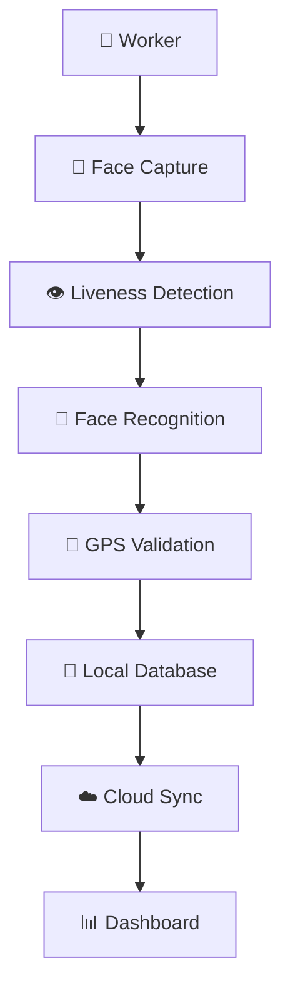

<p align="center">
  
</p>


<div align="center">


<div align="center">


<br>


</div>

<p align="center">
  
  
  
  
  
</p>


---

<div align="center">

# 🛣️ 👷 📸 👁️ 🤖 🔐 📍 ☁️

### Secure Workforce Authentication for the Real World

</div>

---

<p align="center">
🚧━━━━━━━━━━━━━━━━━━━━━━━━━━━━━━━━━━━━━━━━━━━━━━━━━━━━🚧
</p>

# 🎯 Problem Statement

<p align="center">


</p>

Managing attendance and identity verification for field workers remains a major challenge, especially in remote locations where internet connectivity is unreliable.

### Existing Challenges

❌ Dependence on cloud connectivity

❌ Proxy attendance and impersonation

❌ Limited identity verification

❌ Poor performance in low-network areas

Pehechaan solves these problems through AI-powered offline authentication.

---

<p align="center">
🚗══════════════════════════════════════════════════════🛣️
</p>

# 💡 Our Solution

Pehechaan is an AI-powered offline facial authentication and attendance platform built for field workers operating in connectivity-constrained environments.

### Core Capabilities

👤 Face Recognition

👁️ Liveness Detection

📶 Offline Authentication

📍 GPS Verification

☁️ Smart Synchronization

🛡️ Privacy-First Processing

---

<div align="center">

## 👤 ➜ 👁️ ➜ 🤖 ➜ 🔐 ➜ 📍 ➜ ☁️

### Capture → Verify → Authenticate → Track → Sync

</div>

---

# ✨ Key Features

### 🧠 AI Face Recognition
Secure biometric verification using facial embeddings.

### 👁️ Liveness Detection
Prevents spoofing through photographs and recorded videos.

### 📶 Offline First
Authentication works completely without internet connectivity.

### 📍 GPS Verification
Ensures location-aware attendance validation.

### ☁️ Automatic Synchronization
Uploads attendance records once connectivity returns.

### 🛡️ Privacy Focused
Processes sensitive data locally whenever possible.

### ⚡ Fast Verification
Authentication in milliseconds.

---

<p align="center">
🚧━━━━━━━━━━ HIGHWAY AUTHENTICATION JOURNEY ━━━━━━━━━━🚧
</p>

# 🔄 Authentication Workflow

```text
👷 Worker
      │
      ▼
📸 Face Scan
      │
      ▼
👁️ Liveness Check
      │
      ▼
🤖 Face Matching
      │
      ▼
📍 GPS Capture
      │
      ▼
💾 Local Storage
      │
      ▼
☁️ Cloud Sync
      │
      ▼
✅ Attendance Recorded
```

---

# 🧠 AI Authentication Pipeline

```text
📸 Face Capture
       │
       ▼
🖼️ Image Processing
       │
       ▼
👁️ Liveness Detection
       │
       ▼
🧠 Feature Extraction
       │
       ▼
🤖 Face Matching
       │
       ▼
✅ Authentication Result
```

---

# 🏗️ System Architecture



---

# ⚡ Performance Metrics

| Metric | Performance |
|----------|----------|
| ⚡ Recognition Time | 200–400 ms |
| 📶 Internet Requirement | None |
| 🔐 Authentication | Offline |
| 📍 GPS Validation | Enabled |
| ☁️ Auto Sync | Enabled |
| 🛡️ Fraud Protection | High |

---

<p align="center">
🛣️══════════════════════════════════════════════════════🏁
</p>

# 📊 Project Impact

Pehechaan addresses workforce authentication challenges in sectors where connectivity cannot be guaranteed.

| Sector | Impact |
|----------|----------|
| 🛣️ Highway Projects | Workforce Verification |
| 🏗️ Construction Sites | Attendance Tracking |
| 🚜 Field Operations | Offline Authentication |
| 🏭 Manufacturing | Secure Access |
| 🏢 Government Services | Identity Validation |

### Benefits

✅ Offline Authentication

✅ Reduced Attendance Fraud

✅ Faster Verification

✅ Enhanced Privacy

✅ Lower Infrastructure Costs

---

# 📈 Scalability

Designed for deployment from local teams to enterprise-scale infrastructure projects.

### Current Capabilities

- Offline Authentication
- GPS Validation
- Local Storage
- Smart Synchronization

### Future Expansion

🚀 Multi-region deployment

🚀 Enterprise dashboards

🚀 100,000+ workforce support

🚀 Edge AI acceleration

🚀 Multi-language support

🚀 Advanced analytics

---

# 🆚 Why Pehechaan?

| Feature | Traditional Systems | Pehechaan |
|----------|----------|----------|
| Internet Required | ❌ | ✅ |
| Offline Authentication | ❌ | ✅ |
| Liveness Detection | ⚠️ | ✅ |
| GPS Validation | ⚠️ | ✅ |
| Privacy Focused | ⚠️ | ✅ |
| Automatic Sync | ❌ | ✅ |
| Fraud Protection | Low | High |

---

# 🖥️ Technology Stack

### Frontend

- React Native
- Expo

### Backend

- Node.js
- Express.js

### Database

- SQLite
- Local Storage

### AI/ML

- TensorFlow Lite
- Face Recognition
- Liveness Detection
- Edge AI
- TinyML

---

# 🎬 Demonstration

<p align="center">

</p>

---

# 📱 Application Screens

<p align="center">


</p>

---

# 🛣️ Development Roadmap

```text
Face Authentication      ██████████ 100%
Offline Storage          ██████████ 100%
GPS Validation           ██████████ 100%
Cloud Sync               █████████░ 90%

Admin Dashboard          ███████░░░ 70%
Analytics Module         ██████░░░░ 60%
Multi-language Support   ████░░░░░░ 40%
Enterprise Deployment    ███░░░░░░░ 30%
```

---

# 🌍 Real World Applications

🛣️ Highway Workforce Monitoring

🏗️ Construction Site Management

🏭 Manufacturing Attendance

🏢 Government Infrastructure Projects

🚜 Agricultural Workforce Tracking

🏫 Educational Institutions

---

# 🔮 Future Enhancements

- Aadhaar Integration
- Enterprise Analytics
- Edge AI Optimization
- Multi-language Support
- Smart Workforce Insights
- Multi-device Synchronization

---

<p align="center">
🏁━━━━━━━━━━━━━━ TEAM PEHECHAAN ━━━━━━━━━━━━━━🏁
</p>

# 👨‍💻 Team

<table align="center">
<tr>

<td align="center">

### 👩‍💻 AISHI DE

Frontend Development  
UI/UX Design  
Documentation & Presentation

</td>

<td align="center">

### 👨‍💻 PARTHIV ABHANI

Backend Development  
System Architecture  
Integration

</td>

<td align="center">

### 🤖 SHLOK VIJ

AI/ML Development  
Face Recognition  
Liveness Detection

</td>

</tr>
</table>

---

# 🏆 NHAI Hackathon 7.0

🛣️ Theme: Smart Workforce Authentication

🔐 Focus: Offline Identity Verification

🤖 Technology: Edge AI + TinyML

📍 Target: Field Workforce Management

---

<div align="center">

# 🚀 PEHECHAAN

### Authenticate Anywhere • Trust Everywhere

Built with ❤️ for NHAI Hackathon 7.0

### 👩‍💻 AISHI DE • 👨‍💻 PARTHIV ABHANI • 🤖 SHLOK VIJ

</div>


